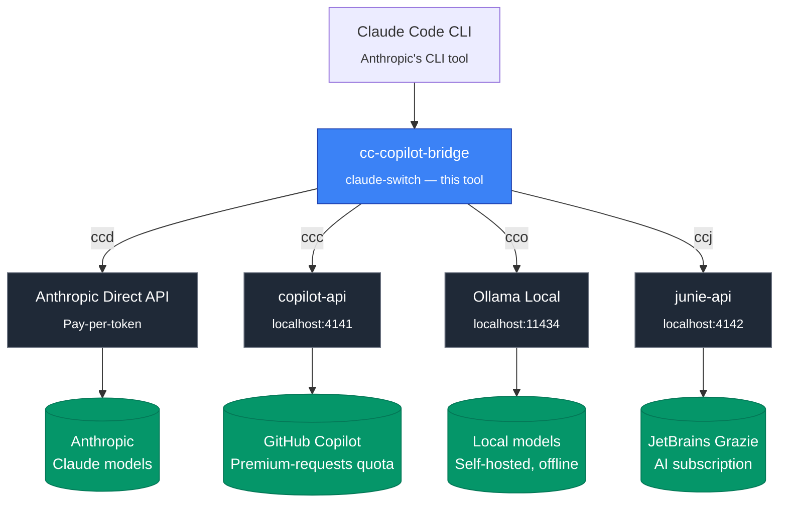

# cc-copilot-bridge

> **TL;DR**: Bash script that routes Claude Code CLI through multiple AI providers. Switch between Anthropic Direct API, GitHub Copilot (via copilot-api proxy), Ollama local, or JetBrains Junie with simple aliases (`ccd`, `ccc`, `cco`, `ccj`).

> 📖 **New to Claude Code?** Check out the [Claude Code Ultimate Guide](https://cc.bruniaux.com/) for comprehensive documentation, tips, and best practices.

<div align="center">

[](https://opensource.org/licenses/MIT)
[](https://github.com/FlorianBruniaux/cc-copilot-bridge/releases)
[]()
[](https://www.gnu.org/software/bash/)
[](https://github.com/FlorianBruniaux/cc-copilot-bridge/stargazers)
[](https://github.com/FlorianBruniaux/cc-copilot-bridge/issues)
[](CONTRIBUTING.md)
[](https://florian.bruniaux.com/)

**Multi-provider routing for Claude Code CLI**

Use your existing GitHub Copilot subscription with Claude Code, or run 100% offline with Ollama. Access Claude, GPT, and Gemini models through a unified interface.

🌐 **[View Landing Page](https://florianbruniaux.github.io/cc-copilot-bridge-landing/)** • [Quick Start](#-quick-start) • [Pricing & Limits](#-github-copilot-pricing--limits) • [Features](#-features) • [Risk Disclosure](#-risk-disclosure)

</div>

---

## StarMapper

<a href="https://starmapper.bruniaux.com/FlorianBruniaux/cc-copilot-bridge">
  <picture>
    <source media="(prefers-color-scheme: dark)" srcset="https://starmapper.bruniaux.com/api/map-image/FlorianBruniaux/cc-copilot-bridge?theme=dark" />
    <source media="(prefers-color-scheme: light)" srcset="https://starmapper.bruniaux.com/api/map-image/FlorianBruniaux/cc-copilot-bridge?theme=light" />
    
  </picture>
</a>

---

## 🎯 What Is This?

A **multi-provider router** for Claude Code CLI that lets you switch between AI backends with simple aliases.

### Four Providers, One Interface

| Provider | Command | Use Case | Cost Model |
|----------|---------|----------|------------|
| **Anthropic Direct** | `ccd` | Production, maximum quality | Pay-per-token |
| **GitHub Copilot** | `ccc` | Daily development | Premium requests quota |
| **Ollama Local** | `cco` | Offline, proprietary code | Free (local compute) |
| **JetBrains Junie** | `ccj` | JetBrains ecosystem / Gemini-first workflows | JetBrains AI subscription |

### Architecture Overview



---

## 🚀 Quick Start

### Installation

**Recommended: Package Managers** (clean, dependency-managed, easy updates)

<details>
<summary><b>Homebrew (macOS/Linux)</b></summary>

```bash
brew tap FlorianBruniaux/tap
brew install cc-copilot-bridge
eval "$(claude-switch --shell-config)"
```

Add to `~/.zshrc`: `eval "$(claude-switch --shell-config)"`

</details>

<details>
<summary><b>Debian/Ubuntu (.deb)</b></summary>

```bash
VERSION="1.5.3"  # Check releases for latest
wget https://github.com/FlorianBruniaux/cc-copilot-bridge/releases/download/v${VERSION}/claude-switch_${VERSION}.deb
sudo dpkg -i claude-switch_${VERSION}.deb
eval "$(claude-switch --shell-config)"
```

Add to `~/.bashrc`: `eval "$(claude-switch --shell-config)"`

</details>

<details>
<summary><b>RHEL/Fedora (.rpm)</b></summary>

```bash
VERSION="1.5.3"  # Check releases for latest
wget https://github.com/FlorianBruniaux/cc-copilot-bridge/releases/download/v${VERSION}/claude-switch-${VERSION}-1.noarch.rpm
sudo rpm -i claude-switch-${VERSION}-1.noarch.rpm
eval "$(claude-switch --shell-config)"
```

Add to `~/.bashrc`: `eval "$(claude-switch --shell-config)"`

</details>

<details>
<summary><b>JetBrains Junie (optional 4th provider)</b></summary>

To enable the `ccj` alias, authenticate with your JetBrains account first, then launch Claude Code through the Junie proxy:

```bash
# 1. Authenticate once with your JetBrains AI subscription
bunx junie-api auth

# 2. Start Claude Code routed through Junie
ccj
```

> ⚠️ Junie integration uses a reverse-engineered proxy of JetBrains Junie/Grazie. Not officially supported by JetBrains; may break at any time. Use with a personal subscription only. See [Risk Disclosure](#-risk-disclosure).

</details>

**Alternative: Script Install** (if package managers unavailable)

```bash
curl -fsSL https://raw.githubusercontent.com/FlorianBruniaux/cc-copilot-bridge/main/install.sh | bash
```

**Full guides**:
- [Package Managers](docs/PACKAGE-MANAGERS.md) - Recommended method
- [Quick Start](QUICKSTART.md) - All installation options
- [Install Options](docs/INSTALL-OPTIONS.md) - Integration with antigen, oh-my-zsh, etc.

### Aliases Included

The installer creates `~/.claude/aliases.sh` with these commands:

```bash
# Core commands (created automatically)
ccd        # Anthropic API (paid)
ccc        # GitHub Copilot (default: Claude Sonnet 4.6)
cco        # Ollama Local (offline)
ccj        # JetBrains Junie (default: Gemini 2.5 Pro)
ccs        # Check all providers

# Model shortcuts (40+ models)
ccc-opus='COPILOT_MODEL=claude-opus-4-6 claude-switch copilot'
ccc-sonnet='COPILOT_MODEL=claude-sonnet-4-6 claude-switch copilot'
ccc-gpt='COPILOT_MODEL=gpt-4.1 claude-switch copilot'
ccc-grok='COPILOT_MODEL=grok-code-fast-1 claude-switch copilot'
ccc-prod, ccc-dev, ccc-quick, ccc-alt, ccc-private  # semantic shortcuts
```

See [INSTALL-OPTIONS.md](docs/INSTALL-OPTIONS.md) for integration with antigen, oh-my-zsh, zinit, etc.

### Usage

```bash
# Start with Copilot (free via your subscription)
ccc

# Switch models on-the-fly
COPILOT_MODEL=gpt-4.1 ccc
COPILOT_MODEL=claude-opus-4-6 ccc

# JetBrains Junie provider
ccj                                      # JetBrains Junie (default: Gemini 2.5 Pro)
JUNIE_MODEL=openai-gpt4.1 ccj             # GPT-5 via Junie

# Check status
ccs
```

**Visual Examples**:

**Claude Sonnet 4.6 (Default)**:


**Claude Opus 4.6 (Premium)**:


**GPT-4.1 (OpenAI)**:


**Ollama Offline (Private)**:


---

## 💰 GitHub Copilot Pricing & Limits

**Important**: Using Claude Code via Copilot consumes your **premium request quota**. Usage is NOT unlimited.

### Current Plans (January 2026)

| Plan | Monthly Cost | Premium Requests | Notes |
|------|--------------|------------------|-------|
| **Copilot Free** | $0 | 50 | Limited model access |
| **Copilot Pro** | $10 | 300 | Access to most models |
| **Copilot Pro+** | $39 | 1,500 | Full model access |
| **Copilot Business** | $19/user | 300 | Organization features |
| **Copilot Enterprise** | $39/user | 1,000 | Custom models, knowledge bases |

### Model Multipliers

Different models consume different amounts of premium requests per interaction:

| Model | Multiplier | Effective Quota (Pro, 300 req) | Effective Quota (Pro+, 1500 req) |
|-------|-----------|-------------------------------|----------------------------------|
| **GPT-4.1, GPT-4o** | 0x | **Unlimited** | **Unlimited** |
| **Grok Code Fast 1** | 0.25x | ~1,200 interactions | ~6,000 interactions |
| Claude Haiku 4.5 | 0.33x | ~900 interactions | ~4,500 interactions |
| Claude Sonnet 4.6 | 1x | 300 interactions | 1,500 interactions |
| Gemini 2.5 Pro | 1x | 300 interactions | 1,500 interactions |
| GPT-5.3-Codex | 1x | 300 interactions | 1,500 interactions |
| ~~gpt-5~~ *(deprecated 17 Feb 2026)* | ~~1x~~ | — | — |
| ~~gpt-5-codex~~ *(deprecated)* | ~~1x~~ | — | — |
| **Claude Opus 4.6** | 3x | ~100 interactions | ~500 interactions |

**Key insight**: GPT-4.1 and GPT-4o are **free** (0x multiplier) on paid plans. Use them for routine tasks to preserve premium requests for Claude/Opus.

### Quota Behavior

- Quotas reset on the **1st of each month** (00:00 UTC)
- Unused requests **do not carry over**
- When quota is exhausted, system **falls back to free models** (GPT-4.1)
- Optional: Enable spending budgets for overflow at $0.04/request

**Source**: [GitHub Copilot Plans](https://docs.github.com/en/copilot/about-github-copilot/subscription-plans-for-github-copilot)

### JetBrains Junie

Routing through `ccj` uses your **JetBrains AI subscription** via the Junie/Grazie backend. There is no per-token billing from this project — quotas follow your JetBrains plan.

- **Plan required**: An active JetBrains AI / Junie / Grazie subscription on your JetBrains account
- **Access tier**: Whatever your plan grants (Gemini 2.5 Pro, GPT-5, Claude families, etc. — subject to JetBrains' model catalog)
- **Billing**: Handled by JetBrains; no Anthropic/GitHub quota is consumed
- ⚠️ **Reverse-engineered**: `junie-api` is a community reverse-engineering of JetBrains' internal protocol, **not** an official JetBrains integration. It is **subject to JetBrains AI Terms of Service**, and excessive automated use may violate those terms and risk account action. Use with a personal subscription only, and at your own risk.

**Source**: [JetBrains AI Terms of Service](https://www.jetbrains.com/legal/docs/terms/jetbrains-ai/) · [junie-api](https://github.com/fabienfleureau/junie-api)

---

## 🎨 Features

### 1. **Instant Provider Switching** (3 characters)

```bash
ccd     # Anthropic Direct API (production)
ccc     # GitHub Copilot Bridge (prototyping)
cco     # Ollama Local (offline/private)
ccj     # JetBrains Junie (Gemini-first)
```

No config changes, no restarts, no environment variable juggling.

🧪 **JetBrains Junie** — Use your JetBrains Junie/Grazie subscription; access Gemini, GPT, and Claude models through JetBrains' AI service (reverse-engineered proxy; may break; use at own risk).

**Help Menu**:


**Available commands**:
- `ccs` / `claude-switch status` - Check all providers health
- `claude-switch --help` - Full command reference

### 2. **Dynamic Model Selection** (40+ models)

| Provider | Models | Cost Model |
|----------|--------|------------|
| **Anthropic** | opus-4-6, sonnet-4-6, haiku-4.5 | Per token |
| **Copilot** | claude-*, gpt-4.1, gpt-5, gemini-*, **gpt-codex*** | Premium requests quota |
| **Ollama** | devstral, granite4, qwen3-coder | Free (local) |

```bash
# Switch models mid-session
ccc                     # Default: claude-sonnet-4-6
ccc-opus                # Claude Opus 4.6
ccc-gpt                 # GPT-4.1
COPILOT_MODEL=gemini-2.5-pro ccc  # Gemini

# Ollama models
cco                     # Default: devstral-small-2
cco-devstral            # Explicit Devstral
cco-granite             # Granite4 (long context)
```

### 3. **GPT Codex & Gemini 3 Models** (via Unified Fork - RECOMMENDED)

GPT Codex models use OpenAI's `/responses` endpoint, and Gemini 3 models have thinking support. Both require a fork of copilot-api that combines PR #167 and #170.

**⚠️ Important**: Codex models are tested and working. Gemini 3 **agentic mode is Supported** - PR #167 adds thinking support, and tool calling issues have been addressed in fork v1.3.1.

**Setup**:
```bash
# Terminal 1: Launch unified fork (auto-clones if needed)
ccunified

# Terminal 2: Use models
ccc-codex         # gpt-5.2-codex ✅ Tested
ccc-gemini3       # gemini-3-flash-preview ✅ Supported
ccc-gemini3-pro   # gemini-3-pro-preview ✅ Supported
```

**Model Status**:
| Model | Endpoint | Status |
|-------|----------|--------|
| `gpt-5.2-codex` | /responses | ✅ Tested |
| `gpt-5.1-codex-mini` | /responses | ✅ Tested |
| `gemini-3-flash-preview` | /chat/completions | ⚠️ Agentic untested |
| `gemini-3-pro-preview` | /chat/completions | ⚠️ Agentic untested |

**What to test for Gemini 3**:
```bash
# 1. Baseline (should work)
ccc-gemini3 -p "1+1"

# 2. Agentic mode (uncertain - please report results!)
ccc-gemini3
❯ Create a file test.txt with "hello"
```

**Fork source**: [caozhiyuan/copilot-api branch 'all'](https://github.com/caozhiyuan/copilot-api/tree/all) | [PR #167](https://github.com/ericc-ch/copilot-api/pull/167) | [PR #170](https://github.com/ericc-ch/copilot-api/pull/170)

📖 **Full guide**: [docs/ALL-MODEL-COMMANDS.md](docs/ALL-MODEL-COMMANDS.md)

### 5. **MCP Profiles System** (Auto-Compatibility)

**Problem**: GPT-4.1 has strict JSON schema validation → breaks some MCP servers

**Solution**: Auto-generated profiles exclude incompatible servers

```bash
~/.claude/mcp-profiles/
├── excludes.yaml       # Define problematic servers
├── generate.sh         # Auto-generate profiles
└── generated/
    ├── gpt.json       # GPT-compatible (9/10 servers)
    └── gemini.json    # Gemini-compatible
```

### 6. **Model Identity Injection**

**Problem**: GPT-4.1 thinks it's Claude when running through Claude Code CLI

**Solution**: System prompts injection

```bash
~/.claude/mcp-profiles/prompts/
├── gpt-4.1.txt        # "You are GPT-4.1 by OpenAI..."
└── gemini.txt         # "You are Gemini by Google..."
```

**Result**: Models correctly identify themselves

### 7. **Health Checks & Fail-Fast**

```bash
ccc
# → ERROR: copilot-api not running on :4141
#    Start it with: copilot-api start (or scripts/launch-unified-fork.sh)
```

### 8. **Session Logging**

```bash
tail ~/.claude/claude-switch.log

[2026-01-22 09:42:33] [INFO] Provider: GitHub Copilot - Model: gpt-4.1
[2026-01-22 09:42:33] [INFO] Using restricted MCP profile for gpt-4.1
[2026-01-22 09:42:33] [INFO] Injecting model identity prompt for gpt-4.1
[2026-01-22 10:15:20] [INFO] Session ended: duration=32m47s exit=0
```

---

## 🏗️ Provider Architecture

### 🎯 GitHub Copilot Bridge

**Use Case**: Daily coding, prototyping, exploration

```bash
ccc                               # Default: claude-sonnet-4-6
ccc-gpt                          # GPT-4.1 (0x multiplier = free)
ccc-opus                         # Claude Opus 4.6 (3x multiplier)
COPILOT_MODEL=gemini-2.5-pro ccc # Gemini
```

**How It Works**:
- Routes through [copilot-api](https://github.com/ericc-ch/copilot-api) proxy
- Uses your Copilot premium request quota (see [Pricing & Limits](#-github-copilot-pricing--limits))
- Access to 15+ models (Claude, GPT, Gemini families)
- Best for: Daily development, experimentation, learning

**copilot-api Running**:


*Screenshot: copilot-api proxy server logs showing active connections*

**Requirements**:
1. GitHub Copilot Pro ($10/mo) or Pro+ ($39/mo) subscription
2. copilot-api running locally (`copilot-api start` or `scripts/launch-unified-fork.sh`)

---

### 🎁 BONUS: Ollama Local (Offline Mode)

**Use Case**: Offline work, proprietary code, air-gapped environments

```bash
cco                                          # Default: devstral-small-2
OLLAMA_MODEL=devstral-64k cco               # With 64K context (recommended)
OLLAMA_MODEL=ibm/granite4:small-h cco       # Granite4 (long context, 70% less VRAM)
```

**How It Works**:
- Self-hosted inference (no internet required)
- Free, 100% private
- Apple Silicon optimized (M1/M2/M3/M4 - up to 4x faster)
- Best for: Sensitive code, airplane mode, privacy-first scenarios

**Important**: Ollama is **architecturally independent** from Copilot bridging. It's a separate provider for local inference, not related to copilot-api.

**⚠️ Critical: Context Configuration**

Claude Code sends ~18K tokens of system prompt + tools. Default Ollama context (4K) causes hallucinations and slow responses.

**Create a 64K Modelfile (recommended)**:
```bash
mkdir -p ~/.ollama
cat > ~/.ollama/Modelfile.devstral-64k << 'EOF'
FROM devstral-small-2
PARAMETER num_ctx 65536
PARAMETER temperature 0.15
EOF
ollama create devstral-64k -f ~/.ollama/Modelfile.devstral-64k
OLLAMA_MODEL=devstral-64k cco
```

**Recommended Models (March 2026)**:

SWE-bench measures real-world agentic coding ability (GitHub issue resolution with tool calling, multi-file editing). High HumanEval scores don't guarantee agentic performance.

| Model | SWE-bench Verified | Params | Min RAM | Practical Status | Use Case |
|-------|-------------------|--------|---------|------------------|----------|
| **devstral-small-2** | **68.0%** | 24B | 32GB | ✅ Best agentic (default) | Daily coding, proven reliable |
| **qwen3-coder:30b** | **69.6%** | 30B | 32GB | ⚠️ Needs template work | Highest bench, config issues |
| **ibm/granite4:small-h** | ~62% | 32B (9B active) | 16GB | ✅ Long context | 70% less VRAM, 1M context |
| **glm-4.7-flash** | ~65-68% (estimated) | 30B MoE (3B active) | 16GB | ⚠️ Ollama 0.15.1+ required | Tool calling fix (v0.15.1) |
| **qwen3-coder-next:80b** | **42.8%** | 80B (3B active) | 64GB | ⚠️ High-end only | Near-Sonnet quality, MoE efficient |

**On the radar (not yet locally runnable)**:

| Model | SWE-bench Verified | Params | Status |
|-------|-------------------|--------|--------|
| **DeepSeek V4** | ~80%+ (internal) | 1T | ❌ Cloud only — watch for distilled variants |

> **DeepSeek V4** (released Feb 2026): 1T parameters, 1M context window, Apache 2.0. Top SWE-bench scores but requires 200GB+ RAM even quantized. No runnable distillation confirmed for Ollama yet. Follow [DeepSeek releases](https://github.com/deepseek-ai) for Q4 distillations.

**Benchmark Sources:**
- Devstral-small-2: [Mistral AI](https://mistral.ai/news/devstral-2-vibe-cli) - 68.0% SWE-bench Verified
- Qwen3-coder: [Index.dev](https://www.index.dev/blog/qwen-ai-coding-review) - 69.6% SWE-bench Verified
- Qwen3-Coder-Next: [dev.to](https://dev.to/sienna/qwen3-coder-next-the-complete-2026-guide-to-running-powerful-ai-coding-agents-locally-1k95) - 42.8% SWE-bench Verified (3B active params)
- GLM-4.7 full: [Z.AI](https://z.ai/blog/glm-4.7) - 73.8% (Flash variant "tier lower", no published bench)

**Why Devstral despite lower SWE-bench?**
- Designed specifically for agentic software engineering tasks ([source](https://mistral.ai/news/devstral-2-vibe-cli))
- Native architecture for tool calling vs post-training bolt-on (Qwen3)
- "Best agentic coding" confirmed in practice (CLAUDE.md testing)
- Qwen3 has higher bench but "needs template work" in real usage

**⚠️ Models NOT recommended** (low SWE-bench despite good HumanEval):
- CodeLlama:13b - 40% SWE-bench (no reliable tool calling)
- Llama3.1:8b - **15%** SWE-bench ("catastrophic failure" on agentic tasks)

**Requirements**:
1. Ollama installed (`ollama.ai`)
2. Models downloaded (`ollama pull devstral-small-2`)

> **Note**: Ollama uses GGUF format (universal). For maximum Mac performance with small models (<22B), LM Studio + MLX can be up to 4x faster. However, for models >30B, GGUF becomes more performant. LM Studio is not compatible with claude-switch.

---

### 🔄 FALLBACK: Anthropic Direct API

**Use Case**: Production, maximum quality, critical analysis

```bash
ccd
```

**How It Works**:
- Official Anthropic API
- Pay per token ($0.015-$75 per 1M tokens)
- Best for: Production code review, security audits, critical decisions

**Requirements**:
1. `ANTHROPIC_API_KEY` environment variable
2. Anthropic account with billing

---

## 📊 Alternatives

For general multi-provider routing, see [@musistudio/claude-code-router](https://www.npmjs.com/package/@musistudio/claude-code-router) (31.9k weekly downloads). For a complete open-source alternative, see [OpenCode](https://github.com/opencode-ai/opencode) (48k stars).

**cc-copilot-bridge** specifically serves Copilot Pro+ subscribers who want to use Claude Code CLI with their existing subscription.

📖 [Full Competitive Analysis →](docs/research/COMPETITIVE-ANALYSIS.md)

---

## 🎬 Real-World Workflows

### Workflow 1: Quota-Optimized Development

```bash
# Use GPT-4.1 for routine tasks (0x multiplier = doesn't consume quota)
ccc-gpt
❯ Build user authentication flow

# Use Claude Sonnet for complex logic (1x multiplier)
ccc
❯ Design database schema

# Use Anthropic Direct for production review (official API)
ccd
❯ Security audit of auth implementation
```

### Workflow 2: Multi-Model Validation

```bash
# Compare approaches across models
ccc-gpt       # GPT-4.1 analysis (free)
ccc           # Claude Sonnet analysis (1x)
ccc-opus      # Claude Opus analysis (3x - use sparingly)
```

### Workflow 3: Offline Development

```bash
# Work on proprietary code (airplane mode)
cco
❯ Implement proprietary encryption algorithm
# ✅ No internet required
# ✅ Code never leaves machine
```

---

## 📦 What's Included

| Component | Description |
|-----------|-------------|
| **claude-switch** | Main script (provider switcher) |
| **install.sh** | Auto-installer |
| **mcp-check.sh** | MCP compatibility checker |
| **MCP Profiles** | Auto-generated configs for strict models |
| **System Prompts** | Model identity injection |
| **Health Checks** | Fail-fast validation |
| **Session Logging** | Full audit trail |

---

## 🔧 Requirements

- **Claude Code CLI** (Anthropic)
- **copilot-api** for Copilot provider
  - **Recommended**: [caozhiyuan/copilot-api v1.3.1](https://github.com/caozhiyuan/copilot-api/tree/all) (fork — actively maintained, native Anthropic Messages API, Codex `/responses` endpoint, gpt-5.4, gemini-3.1)
  - **Official**: [ericc-ch/copilot-api](https://github.com/ericc-ch/copilot-api) (stalled since Oct 2025, last release v0.7.0)
  - ⚠️ **Note**: Community patch applied to fix [issue #174](https://github.com/ericc-ch/copilot-api/issues/174) (reserved billing header). See [TROUBLESHOOTING.md](docs/TROUBLESHOOTING.md#patch-communautaire-solution-avancée) for details.
- **Ollama** (optional, for local provider)
- **jq** (JSON processing)
- **nc** (netcat, for health checks)

---

## 📚 Documentation

### This Project
- **QUICKSTART.md** - 2-minute setup
- **[ALIASES.md](docs/ALIASES.md)** - Complete command reference (30+ aliases)
- **MODEL-SWITCHING.md** - Dynamic model selection guide
- **MCP-PROFILES.md** - MCP Profiles & System Prompts
- **SECURITY.md** - Security, privacy, and compliance guide
- **OPTIMISATION-M4-PRO.md** - Apple Silicon optimization
- **TROUBLESHOOTING.md** - Problem resolution

### Claude Code Resources
- 📖 **[Claude Code Ultimate Guide](https://florianbruniaux.github.io/claude-code-ultimate-guide-landing/)** - Comprehensive guide to Claude Code CLI
- 🔗 **[Ultimate Guide Repository](https://github.com/FlorianBruniaux/claude-code-ultimate-guide)** - Complete documentation, tips, and best practices

---

## 🎯 Who Should Use This?

### Primary Audience
- **Copilot subscribers** who want to use Claude Code CLI with their existing subscription
- **Multi-model users** who want to compare Claude, GPT, and Gemini responses
- **Developers** who want a unified interface across multiple AI providers

### Secondary Audience
- **Privacy-conscious developers** who need offline mode for proprietary code (Ollama)
- **Teams in air-gapped environments** who can't use cloud APIs (Ollama)
- **Production users** who need Anthropic Direct API for critical analysis

---

## 🚀 Version

**Current**: v1.7.0

**Changelog**: See [CHANGELOG.md](CHANGELOG.md)

---

## ⚠️ Risk Disclosure

### Terms of Service Considerations

This project uses [copilot-api](https://github.com/ericc-ch/copilot-api), a community tool that reverse-engineers GitHub Copilot's API.

**Important disclaimers:**

1. **Not officially supported**: copilot-api is not endorsed by GitHub, Microsoft, Anthropic, or any AI provider
2. **ToS risk**: Using third-party proxies to access Copilot may violate [GitHub Copilot Terms of Service](https://docs.github.com/en/site-policy/github-terms/github-copilot-product-specific-terms)
3. **Account suspension**: GitHub reserves the right to suspend accounts for ToS violations "at its sole discretion" without prior notice
4. **API changes**: This tool may stop working at any time if providers change their APIs
5. **No guarantees**: The authors provide no warranty and accept no liability for account suspension or service interruption

### Documented Risks

Community reports indicate that:
- Accounts using high volumes through third-party proxies have been suspended
- Suspensions may affect your entire GitHub account, not just Copilot access
- GitHub does not provide a public definition of "excessive usage" or "abuse"

### Recommendations

| Use Case | Recommended Provider |
|----------|---------------------|
| **Production code** | Anthropic Direct (`ccd`) - Official API, no ToS risk |
| **Sensitive/proprietary code** | Ollama Local (`cco`) - 100% offline, no cloud |
| **Daily development** | Copilot (`ccc`) - Understand the risks first |
| **JetBrains ecosystem** | Junie (`ccj`) - Personal subscription only, reverse-engineered proxy |
| **Risk-averse users** | Avoid copilot-api and junie-api entirely |

**Source**: [GitHub Terms of Service - API Terms](https://docs.github.com/site-policy/github-terms/github-terms-of-service#h-api-terms)

### JetBrains Junie: Additional Disclosure

The `ccj` provider routes through [junie-api](https://github.com/fabienfleureau/junie-api), a community reverse-engineered proxy of JetBrains Junie/Grazie.

**Important disclaimers specific to Junie**:

1. **Not officially supported by JetBrains** — junie-api is not endorsed by JetBrains s.r.o. or any affiliate
2. **Reverse-engineered protocol** — The underlying API is unstable and may break unexpectedly if JetBrains updates their service
3. **ToS risk** — Automated or high-volume use may violate the [JetBrains AI Terms of Service](https://www.jetbrains.com/legal/docs/terms/jetbrains-ai/), which can result in account action at JetBrains' discretion
4. **Personal use only** — Do not use this integration with JetBrains Business/Enterprise seats or shared credentials
5. **No warranty** — The authors of cc-copilot-bridge and junie-api provide no warranty and accept no liability for subscription cancellation, account suspension, or service interruption
6. **Use at your own risk** — If in doubt, prefer `ccd` (Anthropic Direct) or `cco` (Ollama Local)

---

## Related Projects

Enhance your Claude Code workflow:

- **[Claude Code Ultimate Guide](https://cc.bruniaux.com/)** - Documentation and best practices
- **[ccboard](https://ccboard.bruniaux.com/)** - Dashboard for monitoring and analytics
- **[RTK](https://github.com/FlorianBruniaux/rtk)** - Token reduction proxy
- **[Claude Cowork Guide](https://cowork.bruniaux.com/)** - Desktop automation guide

**More**: [florian.bruniaux.com](https://florian.bruniaux.com/)

---

## 📖 Credits

- **copilot-api**: [ericc-ch/copilot-api](https://github.com/ericc-ch/copilot-api) - The bridge that makes this possible
- **junie-api**: [fabienfleureau/junie-api](https://github.com/fabienfleureau/junie-api) - Reverse-engineered JetBrains Junie/Grazie proxy powering the `ccj` provider (MIT)
- **Claude Code**: [Anthropic](https://www.anthropic.com/) - The CLI tool we're enhancing
- **Ollama**: [ollama.ai](https://ollama.ai/) - Local AI inference

---

## 📄 License

MIT

---

## 🔗 Related Projects

### By the Same Author
- 📖 **[Claude Code Ultimate Guide](https://florianbruniaux.github.io/claude-code-ultimate-guide-landing/)** - Comprehensive guide to mastering Claude Code CLI
  - Complete documentation and best practices
  - Tips & tricks for productivity
  - MCP server integration guides
  - GitHub: [claude-code-ultimate-guide](https://github.com/FlorianBruniaux/claude-code-ultimate-guide)

### Community Tools
- **[copilot-api](https://github.com/ericc-ch/copilot-api)** - GitHub Copilot API proxy (core dependency)
- **[junie-api](https://github.com/fabienfleureau/junie-api)** - JetBrains Junie/Grazie proxy (powers `ccj`)
- **[Ollama](https://ollama.ai/)** - Local AI inference platform
- **awesome-claude-code** - Curated list of Claude Code resources
